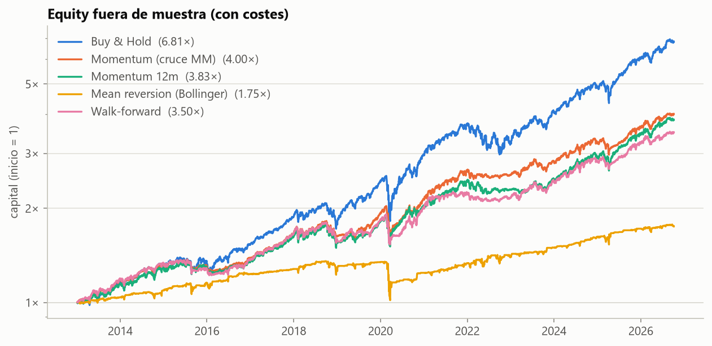

# Quant-Backtester

Motor de backtesting vectorizado en pandas, construido desde cero (sin `backtrader` ni `vectorbt`) para entender la mecánica completa: señales → posiciones → rendimientos, con costes de transacción, slippage y validación *walk-forward*.

Se prueban dos familias de estrategias clásicas —momentum (cruce de medias) y mean reversion (bandas de Bollinger)— sobre un universo pequeño de acciones y ETFs líquidos descargados con `yfinance`.

> **Objetivo del proyecto:** no encontrar "la estrategia ganadora", sino mostrar con rigor por qué la mayoría de estrategias que lucen bien in-sample no sobreviven fuera de muestra.

---

## Resultados

Todas las cifras son **fuera de muestra y sobre el mismo periodo**: del 4-1-2013 (primer año de test del walk-forward) al 7-10-2026. La cartera es equiponderada entre los 10 activos. Las estrategias usan los parámetros por defecto (50/200, 12 meses, Bollinger 20 días y 2σ). El walk-forward reoptimiza el cruce de medias cada año: 3 años de train, 1 de test y una rejilla de 17 combinaciones elegidas por Sharpe. La sección 6 del notebook `03_walkforward` regenera la tabla y el gráfico.



**Con costes (5 bps de comisión + 5 bps de slippage)**

| Estrategia | CAGR | Vol. | Sharpe | Sortino | Max DD | Calmar | Turnover anual |
|---|---|---|---|---|---|---|---|
| Buy & Hold | 15.0% | 14.4% | 1.04 | 1.49 | -28.3% | 0.53 | 0.0× |
| Momentum (cruce MM) | 10.6% | 10.6% | 1.00 | 1.38 | -22.9% | 0.46 | 1.2× |
| Momentum 12m | 10.3% | 10.9% | 0.95 | 1.34 | -20.4% | 0.50 | 1.2× |
| Mean reversion (Bollinger) | 4.2% | 9.2% | 0.49 | 0.71 | -25.0% | 0.17 | 8.7× |
| Walk-forward | 9.5% | 9.9% | 0.97 | 1.33 | -20.0% | 0.48 | 2.5× |

**Sin costes**

| Estrategia | CAGR | Vol. | Sharpe | Sortino | Max DD | Calmar | Turnover anual |
|---|---|---|---|---|---|---|---|
| Buy & Hold | 15.0% | 14.4% | 1.04 | 1.49 | -28.3% | 0.53 | 0.0× |
| Momentum (cruce MM) | 10.8% | 10.6% | 1.01 | 1.40 | -22.9% | 0.47 | 1.2× |
| Momentum 12m | 10.4% | 10.9% | 0.96 | 1.35 | -20.4% | 0.51 | 1.2× |
| Mean reversion (Bollinger) | 5.1% | 9.2% | 0.58 | 0.85 | -24.6% | 0.21 | 8.7× |
| Walk-forward | 9.6% | 9.9% | 0.98 | 1.34 | -20.0% | 0.48 | 2.6× |

**Lectura rápida**

- **Ninguna estrategia bate a buy-and-hold en Sharpe** en este periodo alcista. Las de momentum se le acercan con menos volatilidad y menos drawdown (−20 % a −23 % frente a −28 %), a costa de casi 5 puntos de CAGR.
- **Los costes deciden en las estrategias de alto turnover.** Bollinger mueve 8,7 veces la cartera al año: los costes le quitan casi 1 punto de CAGR y bajan su Sharpe de 0,58 a 0,49. A las estrategias lentas apenas les afectan.
- **Reoptimizar no ha aportado nada fuera de muestra.** El walk-forward (Sharpe 0,97) no mejora los parámetros de libro 50/200 (1,00) y duplica el turnover. La misma estrategia optimizada con todo el histórico llega a un Sharpe de 1,21, pero solo porque elige sus parámetros mirando el periodo en el que se evalúa (notebook 03).
- El turnover de buy-and-hold sale 0,0× porque la entrada inicial queda antes del periodo fuera de muestra.

*Cifras calculadas con los precios descargados de Yahoo Finance el 7-10-2026; cambian ligeramente con cada descarga porque Yahoo recalcula hacia atrás los precios ajustados.*

---

## Estructura del repositorio

```
quant-backtester/
├── README.md
├── requirements.txt         # dependencias
├── requirements-dev.txt     # + regenerar los PDF y ejecutar notebooks en bloque
├── pyproject.toml           # configuración de pytest
├── src/
│   ├── config.py            # universo, fechas, costes, rejillas: todos los parámetros
│   ├── data.py              # descarga y limpieza (yfinance)
│   ├── strategies.py        # señales: momentum, bollinger
│   ├── backtest.py          # motor: señales → posiciones → P&L
│   ├── metrics.py           # sharpe, sortino, drawdown, calmar
│   ├── walkforward.py       # validación out-of-sample
│   └── plotting.py          # gráficos de los notebooks
├── notebooks/
│   ├── 01_exploracion.ipynb
│   ├── 02_estrategias.ipynb
│   └── 03_walkforward.ipynb
├── tests/                   # un fichero por módulo + datos sintéticos (helpers.py)
├── docs/                    # teoría en PDF (00 = guía), fuentes Markdown y progreso.md
└── data/                    # precios descargados (no se versiona)
```

### Cómo está construido: aprender haciendo

El código de soporte (descarga, validaciones, orquestación, tablas y gráficos) está hecho. Las piezas de la materia (rendimientos, el motor, las estrategias, las métricas y el walk-forward) son **26 funciones TODO** que se implementan a mano, guiadas por:

- `docs/00_Guia_paso_a_paso.pdf`: entorno, orden de trabajo y flujo de git. Los capítulos `01`–`06` explican la teoría de cada bloque con pseudocódigo y pistas, y `A` es una chuleta de pandas para series temporales.
- `tests/`: la batería completa hace de autocorrector. Un TODO pendiente aparece como *skipped* "TODO pendiente", no como fallo.
- `docs/progreso.md`: checklist de los TODO.

---

## Plan de desarrollo (3 días)

### Día 1 — Datos y motor

**`data.py`**
- Descarga de 8-10 tickers líquidos (SPY, QQQ, GLD, TLT, AAPL, MSFT…) desde 2010 hasta hoy.
- Precios ajustados, retornos logarítmicos y simples.
- Guardado en parquet para no depender de `yfinance` en cada ejecución.

**`backtest.py`** — el núcleo, vectorizado en pandas
- Entrada: DataFrame de precios y DataFrame de señales (-1, 0, 1) por activo.
- Posiciones = señal desplazada un día (`shift(1)`): la señal calculada con el cierre de hoy decide la posición que se mantiene desde ese cierre hasta el de mañana, y gana el rendimiento de mañana. Usar la señal de hoy para el rendimiento de hoy (sin `shift`) es el error número uno de los backtests caseros y está documentado explícitamente. Suponer que se opera en el mismo cierre en que se calcula la señal es una aproximación; `lag=2` es la versión conservadora.
- Retorno bruto = posición × retorno del activo.
- Costes: `turnover = |posición_t − posición_{t−1}|`; coste = turnover × (comisión en bps + slippage en bps). Valores por defecto: 5 bps + 5 bps.
- Salida: retornos netos, curva de equity, posiciones y turnover acumulado.

**`tests/test_backtest.py`**
- Señal constante en 1 debe reproducir el buy-and-hold menos un coste inicial.
- Señal constante en 0 debe dar retorno cero.

### Día 2 — Estrategias y métricas

**`strategies.py`**
- Momentum: cruce de medias móviles (p. ej. 50/200) y variante de momentum de 12 meses con rebalanceo mensual.
- Mean reversion: bandas de Bollinger (20 días, 2σ); largo bajo la banda inferior, salida en la media.
- Todas las estrategias devuelven señales en el mismo formato, de modo que el motor es agnóstico.

**`metrics.py`**
- CAGR, volatilidad anualizada, Sharpe, Sortino, max drawdown con fechas, Calmar, hit ratio, turnover anual.
- Sharpe implementado a mano y verificado contra `quantstats`.

**`notebooks/02_estrategias.ipynb`**
- Tabla comparativa de las estrategias frente a buy-and-hold, con y sin costes.
- Gráficos de equity y drawdown.
- Análisis del impacto de los costes en estrategias de alto turnover (mean reversion).

### Día 3 — Walk-forward y documentación

**`walkforward.py`**
- Ventanas rodantes: 3 años de entrenamiento, 1 año de test, paso anual.
- En cada ventana, grid search reducido de parámetros (ventanas de medias, σ de Bollinger) en entrenamiento; aplicación del mejor en test.
- Concatenación de los tramos de test: la única curva de equity "honesta".

**`notebooks/03_walkforward.ipynb`**
- Comparación de tres curvas: parámetros fijos, parámetros optimizados in-sample sobre todo el histórico (sobreajuste) y walk-forward.
- Mapa de calor de Sharpe por combinación de parámetros, para mostrar que las zonas "buenas" son estrechas e inestables.

**README**
- Resultados en la primera pantalla (tabla y gráfico).
- Instrucciones de ejecución.
- Decisiones de diseño: el `shift`, el modelo de costes.
- Sección de limitaciones.

### Extensiones (si sobra tiempo)
- *Volatility targeting*: escalar la posición para fijar una volatilidad objetivo del 10 %.
- Tests para el módulo de walk-forward.

---

## Instalación y ejecución

```bash
git clone https://github.com/<usuario>/quant-backtester.git
cd quant-backtester
python -m venv .q-backtester
source .q-backtester/Scripts/activate      # Windows PowerShell: .q-backtester\Scripts\Activate.ps1
python -m pip install -r requirements.txt
python -m src.data          # descarga y guarda los datos
python -m pytest            # ejecuta los tests
```

Después, abre los notebooks en orden (`01` → `02` → `03`). Los PDF de `docs/` se regeneran con `python docs/build_pdfs.py` (requiere `requirements-dev.txt`).

> Usar `python -m pytest` en lugar de `pytest` evita problemas si el entorno virtual se ha movido de carpeta. En Windows con Smart App Control, pyarrow 25.0.x está bloqueado: por eso `requirements.txt` pide `pyarrow<25`.

**Dependencias principales:** `pandas`, `numpy`, `yfinance`, `matplotlib`, `pyarrow`, `pytest`, `quantstats` (solo para verificación de métricas).

---

## Decisiones de diseño

- **Sin look-ahead bias:** las señales se desplazan un día antes de convertirse en posiciones (`w_t = s_{t−1}`). Las estrategias nunca hacen `shift`: el desfase vive en un único sitio, el motor.
- **Costes explícitos:** comisión y slippage en puntos básicos sobre el turnover; se pueden anular para comparar con el resultado bruto.
- **Motor agnóstico:** cualquier estrategia que devuelva un DataFrame de señales (-1, 0, 1) se puede backtestear sin tocar el motor.
- **Validación temporal:** el walk-forward es el único resultado que se considera representativo; las cifras in-sample se muestran solo como contraste.

---

## Limitaciones

- Sesgo de supervivencia: el universo de tickers se elige en el presente.
- Datos diarios al cierre; no se modela intradía ni gaps de apertura.
- Sin modelo de impacto de mercado ni de liquidez.
- Posiciones cortas sin coste de préstamo ni restricciones realistas.
- Sin apalancamiento ni gestión de margen (salvo la extensión de *volatility targeting*, que escala posiciones hasta 2× sin coste de financiación).
